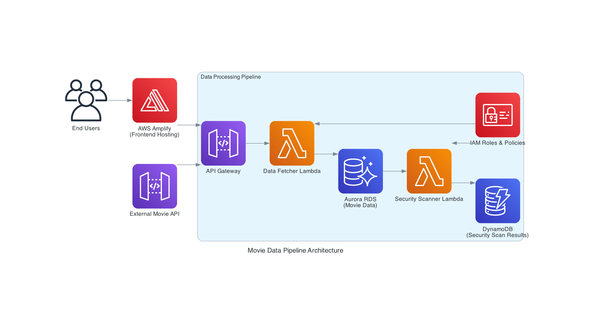

### About the Project

Cloud Security Scout is a robust cloud-based application designed to enhance security in AWS environments by scanning resources for potential vulnerabilities. It incorporates comprehensive logging mechanisms to ensure all activities are tracked and monitored effectively, promoting transparency and quick issue resolution.

At its heart, the application is a user-friendly movie platform built on AWS Amplify, which simplifies frontend-backend integration. Movies are stored securely in an Aurora SQL database, providing reliable and scalable data management. To keep users engaged, a Lambda function is triggered automatically whenever a new movie is added, sending timely notifications to enhance the user experience.

This project demonstrates best practices in cloud security, AWS integration, and event-driven architecture, making it an ideal starting point for developers working on similar applications.

## System Design:



## Security Features Implemented:

Pareto - Principle: Focus on the 20% of security measures that will yield 80% of the protection.

compreshensive discovery
consistent evaluation
timely protection
prioritising remediation

### File Structure

```
cloud_security_scout/
├───frontend/
│   └───y/
│       ├───amplify/
│       │   ├───backend.ts
│       │   └───... (other amplify files)
│       ├───src/
│       │   ├───App.tsx
│       │   └───components/
│       │       └───MovieDashboard.tsx
│       └───... (other frontend files)
├───scripts/
│   ├───main.py
│   ├───s3_check.py
│   └───security_groups.py
├───security_scout/
│   ├───bin/
│   │   └───security_scout.ts
│   ├───lib/
│   │   ├───security_scout-stack.ts
│   │   ├───security-scout-api.ts
│   │   └───... (other lib files)
│   └───test/
│       └───security_scout.test.ts
├───.gitignore
├───README.md
└───... (other config files)
```

## Getting Started

To get started with the Cloud Security Scout project, follow these steps:

1. **Clone the Repository**: Clone the repository to your local machine using Git.

   ```bash
   git clone https://github.com/your-username/cloud_security_scout.git
   cd cloud_security_scout
   ```

2. **Install Dependencies**: Navigate to the `frontend` directory and install the necessary dependencies.

   ```bash
   cd frontend/y
   npm install
   ```

3. **Configure AWS Amplify**: Set up AWS Amplify by following the [official documentation](https://docs.amplify.aws/start/getting-started/setup/q/platform/js). Make sure to configure the backend resources as specified in the project.

4. **Run the Application**: Start the development server to run the application locally.

   ```bash
   npm start
   ```

5. **Access the Application**: Open your web browser and navigate to `http://localhost:3000` to access the Cloud Security Scout application.

6. **Explore the Code**: Familiarize yourself with the project structure and codebase. The main application logic can be found in the `src` directory.

7. **Contribute**: If you'd like to contribute to the project, feel free to submit a pull request with your changes.

## Contact

For any questions or inquiries, please contact me at ceesay.ml@outlook.com.
