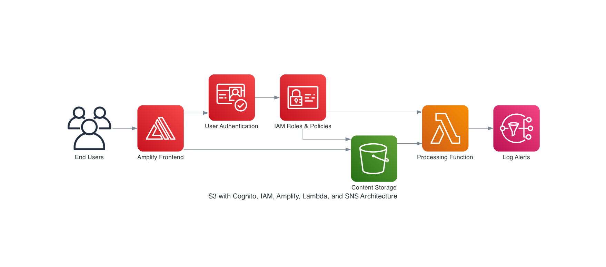

# Welcome to your CDK TypeScript project

## Introduction

This is a project about how a secure file vault works. This project will allow you to learn about the cloud security principles and how to implement them using AWS services.

## Principles

The cloud security principles are a set of best practices and guidelines that help organizations secure their data and applications in the cloud. These principles include:

1. **Least Privilege**: Grant only the permissions necessary for users and applications to perform their tasks.

2. **Defense in Depth**: Use multiple layers of security controls to protect your data and applications.

3. **Data Encryption**: Encrypt sensitive data both at rest and in transit to protect it from unauthorized access.

4. **Identity and Access Management**: Use strong authentication and authorization mechanisms to control access to your resources.

5. **Monitoring and Logging**: Continuously monitor and log access to your resources to detect and respond to security incidents.

6. **Incident Response**: Have a plan in place to respond to security incidents and breaches.

7. **Security by Design**: Incorporate security into the design and architecture of your applications and infrastructure.

8. **Regular Security Assessments**: Regularly assess your security posture and make improvements as needed.

9. **Compliance**: Ensure that your applications and infrastructure comply with relevant regulations and standards.

10. **Security Awareness**: Educate your employees and users about security best practices and how to recognize and respond to security threats.

The `cdk.json` file tells the CDK Toolkit how to execute your app.

## System Design

The system design is based on the principles of cloud security and uses AWS services to implement them. The system consists of the following components:

- **AWS Lambda**: A serverless compute service that runs your code in response to events and automatically manages the underlying compute resources.

- **Amazon S3**: A scalable object storage service that stores your files securely

- **KMS**: A managed encryption service that encrypts your files and data.
- **Amazon Cognito**: A user authentication and authorization service that provides secure access to your resources

- **Amazon API Gateway**: A fully managed service that makes it easy to create, publish, maintain, monitor, and secure APIs at any scale.

- **Amazon DynamoDB**: A fully managed NoSQL database service that provides fast and predictable performance with seamless scalability.

- **Amazon CloudWatch**: A monitoring and observability service that provides data and insights to help you monitor your applications, respond to system-wide performance changes, and optimize resource utilization.

- **AWS IAM**: A service that helps you securely control access to AWS services and resources for your users.



## Environment Setup

This project uses environment variables to securely manage sensitive configuration data. To set up your environment:

1. Copy the `.env.example` file to create a new `.env` file:
   ```bash
   cp .env.example .env
   ```

2. Edit the `.env` file with your actual configuration values:
   ```
   # AWS Deployment Environment Variables
   DEFAULT_EMAIL=your-notification-email@example.com
   DEFAULT_PHONE_NUMBER=+11234567890

   # These are for local development only
   # In production, they will be set by the CDK stack
   SNS_TOPIC_ARN=your-sns-topic-arn
   S3_BUCKET_NAME=your-bucket-name
   S3_BUCKET_REGION=your-region
   CUSTOMER_EMAIL_SUBJECT_PREFIX=S3 File Upload Notification
   ```

3. The `.env` file is included in `.gitignore` to prevent sensitive information from being committed to your repository.

4. When deploying with CDK, the environment variables will be automatically passed to the Lambda function.

### KMS Encryption for Environment Variables

This project uses AWS KMS (Key Management Service) to encrypt sensitive environment variables:

1. **Security of Environment Variables**: All Lambda environment variables are encrypted using a dedicated KMS key created specifically for this purpose.

2. **Automatic Decryption**: AWS Lambda automatically decrypts the environment variables before they are made available to the Lambda function at runtime.

3. **Manual Encryption Support**: The Lambda includes a utility function to decrypt any values manually encrypted with KMS (with a 'kms:' prefix), though this is not typically needed when deploying through CDK.

4. **Infrastructure as Code**: The KMS key is defined in the CDK stack and all necessary IAM permissions are automatically configured.

5. **Key Rotation**: The KMS key is configured with automatic key rotation for enhanced security.

When you deploy the stack with CDK, the environment variables will be automatically encrypted with KMS and securely passed to the Lambda function.

## Useful commands

- `npm run build` compile typescript to js
- `npm run watch` watch for changes and compile
- `npm run test` perform the jest unit tests
- `npx cdk deploy` deploy this stack to your default AWS account/region
- `npx cdk diff` compare deployed stack with current state
- `npx cdk synth` emits the synthesized CloudFormation template
